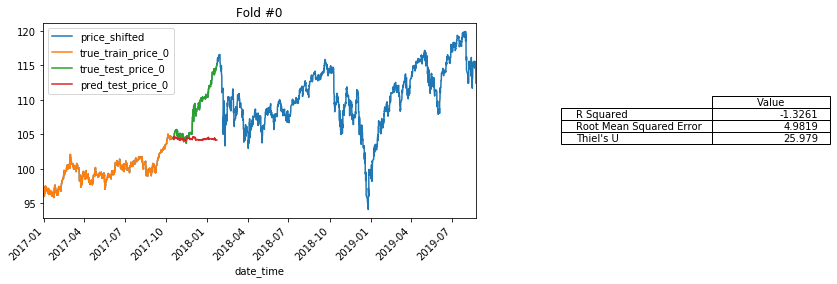
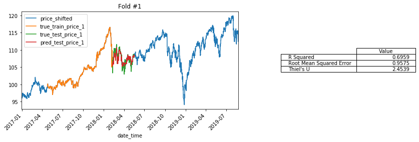
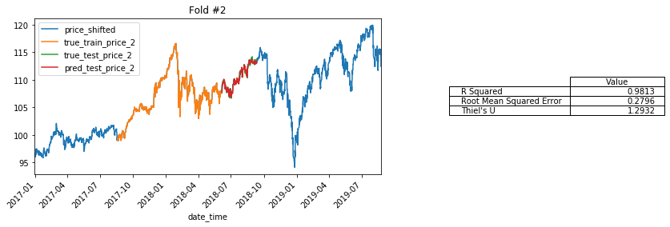
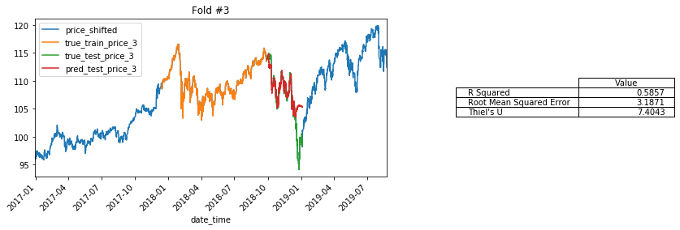
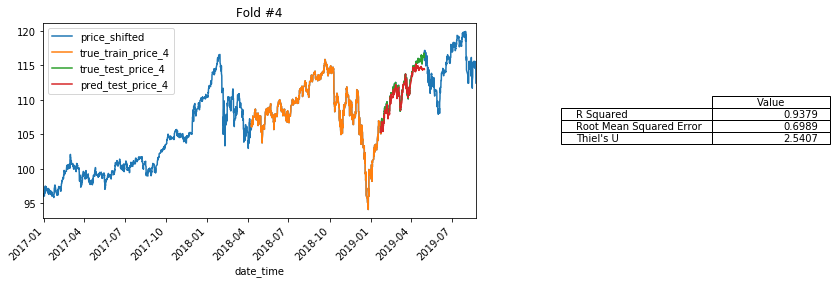

# Custom BlockTimeSeriesSplit Class for K-Fold Validation of Time Series

**BOOKMARKS:**
- [Defining Class BlockTimeSeriesSplit](#def-BlockTimeSeriesSplit)
- [Using BlockTimeSeriesSplit](#Using-`BlockTimeSeriesSplit`)


```python
## IMPORT CUSTOM CAPSTONE FUNCTIONS
import functions_combined_BEST as ji

from functions_combined_BEST import ihelp, ihelp_menu,\
reload, inspect_variables

import pandas as pd
import numpy as np
import matplotlib.pyplot as plt

# ## IMPORT MY PUBLISHED PYPI PACKAGE 
# import bs_ds as  bs
# from bs_ds.imports import *

# Suppress warnings
import warnings
warnings.filterwarnings('ignore')

#Set pd.set_options for tweet visibility
pd.set_option('display.max_colwidth',100)
pd.set_option('display.max_columns',50)
```

    bs_ds  v0.9.10 loaded.  Read the docs: https://bs-ds.readthedocs.io/en/latest/index.html
    For convenient loading of standard modules use: from bs_ds.imports import *
    
    

## def BlockTimeSeriesSplit


```python
from sklearn.model_selection._split import _BaseKFold

class BlockTimeSeriesSplit(_BaseKFold): #sklearn.model_selection.TimeSeriesSplit):
    """A variant of sklearn.model_selection.TimeSeriesSplit that keeps train_size and test_size
    constant across folds. 
    Requires n_splits,train_size,test_size. train_size/test_size can be integer indices or float ratios """
    def __init__(self, n_splits=5,train_size=None, test_size=None, step_size=None, method='sliding'):
        super().__init__(n_splits, shuffle=False, random_state=None)
        self.train_size = train_size
        self.test_size = test_size
        self.step_size = step_size
        if 'sliding' in method or 'normal' in method:
            self.method = method
        else:
            raise  Exception("Method may only be 'normal' or 'sliding'")
        
    def split(self,X,y=None, groups=None):
        import math 
        method = self.method
        ## Get n_samples, trian_size, test_size, step_size
        n_samples = len(X)
        test_size = self.test_size
        train_size =self.train_size
      
                
        ## If train size and test sze are ratios, calculate number of indices
        if train_size<1.0:
            train_size = math.floor(n_samples*train_size)
        
        if test_size <1.0:
            test_size = math.floor(n_samples*test_size)
            
        ## Save the sizes (all in integer form)
        self._train_size = train_size
        self._test_size = test_size
        
        ## calcualte and save k_fold_size        
        k_fold_size = self._test_size + self._train_size
        self._k_fold_size = k_fold_size    
        

    
        indices = np.arange(n_samples)
        
        ## Verify there is enough data to have non-overlapping k_folds
        if method=='normal':
            import warnings
            if n_samples // self._k_fold_size <self.n_splits:
                warnings.warn('The train and test sizes are too big for n_splits using method="normal"\n\
                switching to method="sliding"')
                method='sliding'
                self.method='sliding'
                              
                  
            
        if method=='normal':

            margin = 0
            for i in range(self.n_splits):

                start = i * k_fold_size
                stop = start+k_fold_size

                ## change mid to match my own needs
                mid = int(start+self._train_size)
                yield indices[start: mid], indices[mid + margin: stop]
        

        elif method=='sliding':
            
            step_size = self.step_size
            if step_size is None: ## if no step_size, calculate one
                ## DETERMINE STEP_SIZE
                last_possible_start = n_samples-self._k_fold_size #index[-1]-k_fold_size)\
                step_range =  range(last_possible_start)
                step_size = len(step_range)//self.n_splits
            self._step_size = step_size
                
            
            for i in range(self.n_splits):
                if i==0:
                    start = 0
                else:
                    start = prior_start+self._step_size #(i * step_size)

                stop =  start+k_fold_size            
                ## change mid to match my own needs
                mid = int(start+self._train_size)
                prior_start = start
                yield indices[start: mid], indices[mid: stop]

```

# Load/process test data


```python
df_combined = pd.read_csv('data/__combined_stock_data_with_tweet_preds.csv', index_col=0,parse_dates=True)
model_col_list = ['price','price_shifted', 'ma7', 'ma21', '26ema', '12ema', 'MACD', '20sd', 'upper_band','lower_band', 'ema', 'momentum',
                  'has_tweets','num_tweets','case_ratio', 'compound_score','pos','neu','neg','sentiment_class',
                  'pred_classes','pred_classes_int','total_favorite_count','total_retweet_count']

df_combined = ji.set_timeindex_freq(df_combined,fill_nulls=False)
df_combined.sort_index(inplace=True, ascending=True)
df_combined['price_shifted'] =df_combined['price'].shift(-1)

df_to_model = df_combined[model_col_list].copy()
del df_combined
# df_to_model.head()
```

    Index When:	Freq:	Index Start		Index End:
    Pre-Change	None	2016-12-29 15:30:00	2019-08-23 15:30:00
    [i] Post-Change	<CustomBusinessHour: CBH=09:30-16:30>	2016-12-29 15:30:00	2019-08-23 15:30:00
    
    [i] Filled 0# of rows using method ffill
    Cols with Nulls:
    source                    3500
    is_retweet                3509
    id_str                    3500
    tweet_times               3500
    group_content             3500
    content_cleaned           3506
    content_min_clean         3506
    content_cleaned_stop      3521
    cleaned_stopped_lemmas    3521
    dtype: int64
    


<div>
<style scoped>
    .dataframe tbody tr th:only-of-type {
        vertical-align: middle;
    }

    .dataframe tbody tr th {
        vertical-align: top;
    }

    .dataframe thead th {
        text-align: right;
    }
</style>
<table border="1" class="dataframe">
  <thead>
    <tr style="text-align: right;">
      <th></th>
      <th>price</th>
      <th>ma7</th>
      <th>ma21</th>
      <th>26ema</th>
      <th>12ema</th>
      <th>MACD</th>
      <th>20sd</th>
      <th>upper_band</th>
      <th>lower_band</th>
      <th>ema</th>
      <th>momentum</th>
      <th>date_time.1</th>
      <th>int_tweets_for_stocks</th>
      <th>int_bins</th>
      <th>stock_times</th>
      <th>source</th>
      <th>is_retweet</th>
      <th>id_str</th>
      <th>tweet_times</th>
      <th>num_tweets</th>
      <th>total_retweet_count</th>
      <th>total_favorite_count</th>
      <th>group_content</th>
      <th>has_tweets</th>
      <th>has_stocks</th>
      <th>has_both</th>
      <th>has_RT</th>
      <th>starts_RT</th>
      <th>content_starts_RT</th>
      <th>content_cleaned</th>
      <th>content_min_clean</th>
      <th>case_ratio</th>
      <th>content_hashtags</th>
      <th>hashtag_strings</th>
      <th>content_mentions</th>
      <th>mention_strings</th>
      <th>content_cleaned_stop</th>
      <th>content_cleaned_stop_tokens</th>
      <th>cleaned_stopped_lemmas</th>
      <th>sentiment_scores</th>
      <th>compound_score</th>
      <th>sentiment_class</th>
      <th>neg</th>
      <th>neu</th>
      <th>pos</th>
      <th>pred_classes_int</th>
      <th>pred_classes</th>
      <th>filled_timebin</th>
    </tr>
    <tr>
      <th>date_time</th>
      <th></th>
      <th></th>
      <th></th>
      <th></th>
      <th></th>
      <th></th>
      <th></th>
      <th></th>
      <th></th>
      <th></th>
      <th></th>
      <th></th>
      <th></th>
      <th></th>
      <th></th>
      <th></th>
      <th></th>
      <th></th>
      <th></th>
      <th></th>
      <th></th>
      <th></th>
      <th></th>
      <th></th>
      <th></th>
      <th></th>
      <th></th>
      <th></th>
      <th></th>
      <th></th>
      <th></th>
      <th></th>
      <th></th>
      <th></th>
      <th></th>
      <th></th>
      <th></th>
      <th></th>
      <th></th>
      <th></th>
      <th></th>
      <th></th>
      <th></th>
      <th></th>
      <th></th>
      <th></th>
      <th></th>
      <th></th>
    </tr>
  </thead>
  <tbody>
    <tr>
      <th>2016-12-29 15:30:00</th>
      <td>96.27</td>
      <td>96.864898</td>
      <td>96.277007</td>
      <td>96.573856</td>
      <td>96.730494</td>
      <td>0.156639</td>
      <td>1.002051</td>
      <td>98.281110</td>
      <td>94.272904</td>
      <td>96.263988</td>
      <td>89.27</td>
      <td>2016-12-29 15:30:00</td>
      <td>(2016-12-29 14:30:00, 2016-12-29 15:30:00]</td>
      <td>5</td>
      <td>2016-12-29 15:30:00</td>
      <td>Twitter for iPhone</td>
      <td>False</td>
      <td>814484710025994241</td>
      <td>2016-12-29 14:54:21</td>
      <td>1.0</td>
      <td>11330.0</td>
      <td>45609.0</td>
      <td>My Administration will follow two simple rules: https://t.co/ZWk0j4H8Qy</td>
      <td>1</td>
      <td>True</td>
      <td>True</td>
      <td>False</td>
      <td>False</td>
      <td>[]</td>
      <td>My Administration will follow two simple rules:</td>
      <td>my administration will follow two simple rules</td>
      <td>0.04167</td>
      <td>[]</td>
      <td></td>
      <td>[]</td>
      <td></td>
      <td>administration follow two simple rules</td>
      <td>['administration', 'follow', 'two', 'simple', 'rules']</td>
      <td>administration follow two simple rule</td>
      <td>{'neg': 0.0, 'neu': 1.0, 'pos': 0.0, 'compound': 0.0}</td>
      <td>0.0</td>
      <td>2</td>
      <td>0.0</td>
      <td>1.0</td>
      <td>0.0</td>
      <td>0</td>
      <td>neg</td>
      <td>False</td>
    </tr>
    <tr>
      <th>2016-12-30 09:30:00</th>
      <td>96.38</td>
      <td>96.850204</td>
      <td>96.293537</td>
      <td>96.571218</td>
      <td>96.721997</td>
      <td>0.150779</td>
      <td>0.980655</td>
      <td>98.254848</td>
      <td>94.332227</td>
      <td>96.341329</td>
      <td>89.38</td>
      <td>2016-12-30 09:30:00</td>
      <td>(2016-12-30 08:30:00, 2016-12-30 09:30:00]</td>
      <td>23</td>
      <td>2016-12-30 09:30:00</td>
      <td>NaN</td>
      <td>NaN</td>
      <td>NaN</td>
      <td>NaN</td>
      <td>0.0</td>
      <td>0.0</td>
      <td>0.0</td>
      <td>NaN</td>
      <td>0</td>
      <td>True</td>
      <td>False</td>
      <td>False</td>
      <td>False</td>
      <td>[]</td>
      <td>NaN</td>
      <td>NaN</td>
      <td>0.00000</td>
      <td>[]</td>
      <td></td>
      <td>[]</td>
      <td></td>
      <td>NaN</td>
      <td>[]</td>
      <td>NaN</td>
      <td>{'neg': 0.0, 'neu': 0.0, 'pos': 0.0, 'compound': 0.0}</td>
      <td>0.0</td>
      <td>1</td>
      <td>0.0</td>
      <td>0.0</td>
      <td>0.0</td>
      <td>1</td>
      <td>no_change</td>
      <td>False</td>
    </tr>
    <tr>
      <th>2016-12-30 10:30:00</th>
      <td>96.21</td>
      <td>96.831633</td>
      <td>96.307891</td>
      <td>96.566317</td>
      <td>96.709593</td>
      <td>0.143275</td>
      <td>0.959724</td>
      <td>98.227340</td>
      <td>94.388442</td>
      <td>96.253776</td>
      <td>89.21</td>
      <td>2016-12-30 10:30:00</td>
      <td>(2016-12-30 09:30:00, 2016-12-30 10:30:00]</td>
      <td>24</td>
      <td>2016-12-30 10:30:00</td>
      <td>NaN</td>
      <td>NaN</td>
      <td>NaN</td>
      <td>NaN</td>
      <td>0.0</td>
      <td>0.0</td>
      <td>0.0</td>
      <td>NaN</td>
      <td>0</td>
      <td>True</td>
      <td>False</td>
      <td>False</td>
      <td>False</td>
      <td>[]</td>
      <td>NaN</td>
      <td>NaN</td>
      <td>0.00000</td>
      <td>[]</td>
      <td></td>
      <td>[]</td>
      <td></td>
      <td>NaN</td>
      <td>[]</td>
      <td>NaN</td>
      <td>{'neg': 0.0, 'neu': 0.0, 'pos': 0.0, 'compound': 0.0}</td>
      <td>0.0</td>
      <td>1</td>
      <td>0.0</td>
      <td>0.0</td>
      <td>0.0</td>
      <td>1</td>
      <td>no_change</td>
      <td>False</td>
    </tr>
    <tr>
      <th>2016-12-30 11:30:00</th>
      <td>96.34</td>
      <td>96.814286</td>
      <td>96.322653</td>
      <td>96.563255</td>
      <td>96.700645</td>
      <td>0.137390</td>
      <td>0.938272</td>
      <td>98.199196</td>
      <td>94.446110</td>
      <td>96.311259</td>
      <td>89.34</td>
      <td>2016-12-30 11:30:00</td>
      <td>(2016-12-30 10:30:00, 2016-12-30 11:30:00]</td>
      <td>25</td>
      <td>2016-12-30 11:30:00</td>
      <td>NaN</td>
      <td>NaN</td>
      <td>NaN</td>
      <td>NaN</td>
      <td>0.0</td>
      <td>0.0</td>
      <td>0.0</td>
      <td>NaN</td>
      <td>0</td>
      <td>True</td>
      <td>False</td>
      <td>False</td>
      <td>False</td>
      <td>[]</td>
      <td>NaN</td>
      <td>NaN</td>
      <td>0.00000</td>
      <td>[]</td>
      <td></td>
      <td>[]</td>
      <td></td>
      <td>NaN</td>
      <td>[]</td>
      <td>NaN</td>
      <td>{'neg': 0.0, 'neu': 0.0, 'pos': 0.0, 'compound': 0.0}</td>
      <td>0.0</td>
      <td>1</td>
      <td>0.0</td>
      <td>0.0</td>
      <td>0.0</td>
      <td>1</td>
      <td>no_change</td>
      <td>False</td>
    </tr>
    <tr>
      <th>2016-12-30 12:30:00</th>
      <td>96.25</td>
      <td>96.794694</td>
      <td>96.336531</td>
      <td>96.559027</td>
      <td>96.689742</td>
      <td>0.130715</td>
      <td>0.912397</td>
      <td>98.161325</td>
      <td>94.511736</td>
      <td>96.270420</td>
      <td>89.25</td>
      <td>2016-12-30 12:30:00</td>
      <td>(2016-12-30 11:30:00, 2016-12-30 12:30:00]</td>
      <td>26</td>
      <td>2016-12-30 12:30:00</td>
      <td>NaN</td>
      <td>NaN</td>
      <td>NaN</td>
      <td>NaN</td>
      <td>0.0</td>
      <td>0.0</td>
      <td>0.0</td>
      <td>NaN</td>
      <td>0</td>
      <td>True</td>
      <td>False</td>
      <td>False</td>
      <td>False</td>
      <td>[]</td>
      <td>NaN</td>
      <td>NaN</td>
      <td>0.00000</td>
      <td>[]</td>
      <td></td>
      <td>[]</td>
      <td></td>
      <td>NaN</td>
      <td>[]</td>
      <td>NaN</td>
      <td>{'neg': 0.0, 'neu': 0.0, 'pos': 0.0, 'compound': 0.0}</td>
      <td>0.0</td>
      <td>1</td>
      <td>0.0</td>
      <td>0.0</td>
      <td>0.0</td>
      <td>1</td>
      <td>no_change</td>
      <td>False</td>
    </tr>
  </tbody>
</table>
</div>


### Using Pipeline to Prepare Data for Modeling

- Note: this section was me learning to using Pipelines and ColumnTransformer. It is used for processing the data but is NOT meant to be an example. 


```python
## Using ColumnTransformer
from sklearn.model_selection import TimeSeriesSplit,train_test_split, GridSearchCV,cross_val_score,KFold
from sklearn.pipeline import Pipeline
from sklearn.preprocessing import StandardScaler, OneHotEncoder,MinMaxScaler
from sklearn.compose import ColumnTransformer, make_column_transformer 
from sklearn.pipeline import make_pipeline
from sklearn.model_selection import train_test_split
from sklearn.impute import SimpleImputer


import xgboost as xgb
target_col= 'price_shifted'
## Sort_index
cols_to_drop =['price','pred_classes_int']
cols_to_drop.append(target_col)

features = df_to_model.drop(cols_to_drop, axis=1)
target = df_to_model[target_col]

## Get boolean masks for which columns to use
numeric_cols = features.dtypes=='float'
category_cols = ~numeric_cols
# target_col = df_to_model.columns=='price_shifted'

price_transformer = Pipeline(steps=[
    ('scaler',MinMaxScaler())
])

## define pipeline for preparing numeric data
numeric_transformer = Pipeline(steps=[
#     ('imputer',SimpleImputer(strategy='median')),
    ('scaler',MinMaxScaler())
])

category_transformer = Pipeline(steps=[
#     ('imputer',SimpleImputer(missing_values=np.nan,
#                              strategy='constant',fill_value='missing')),
    ('onehot',OneHotEncoder(handle_unknown='ignore'))
])


## define pipeline for preparing categorical data
preprocessor = ColumnTransformer(remainder='passthrough',
                                 transformers=[
                                     ('num',numeric_transformer, numeric_cols),
                                     ('cat',category_transformer,category_cols)])
```


```python
### ADDING MY OWN TRANSFORMATION SO CAN USE FEATURE IMPROTANCE
df_tf =pd.DataFrame()

## Define Number vs Category Cols
num_cols_list = numeric_cols[numeric_cols==True]
cat_cols_list = category_cols[category_cols==True]

for col in df_to_model.columns:
    
    if col in num_cols_list:
#         print(f'{col} is numeric')
        vals = df_to_model[col].values
        tf_num = numeric_transformer.fit_transform(vals.reshape(-1,1))
        
        try:
            df_tf[col] = tf_num.flatten()
#             print(f"{col} added")
        except:
            continue
#             print(f'Error flattening {col}, shape={tf_num.shape}')
#             print(tf_num.shape)
#             print(tf_num[:10])
        
    if col in cat_cols_list:
#         print(f'{col} is categorical')
        df_temp = pd.get_dummies(df_to_model[col])#DataFrame(data=tf_cats[:],index=df_to_model.index)
        df_tf = pd.concat([df_tf,df_temp],axis=1)

df_tf.head()
```


<div>
<style scoped>
    .dataframe tbody tr th:only-of-type {
        vertical-align: middle;
    }

    .dataframe tbody tr th {
        vertical-align: top;
    }

    .dataframe thead th {
        text-align: right;
    }
</style>
<table border="1" class="dataframe">
  <thead>
    <tr style="text-align: right;">
      <th></th>
      <th>ma7</th>
      <th>ma21</th>
      <th>26ema</th>
      <th>12ema</th>
      <th>MACD</th>
      <th>20sd</th>
      <th>upper_band</th>
      <th>lower_band</th>
      <th>ema</th>
      <th>momentum</th>
      <th>0</th>
      <th>1</th>
      <th>0</th>
      <th>1</th>
      <th>2</th>
      <th>neg</th>
      <th>no_change</th>
      <th>pos</th>
    </tr>
  </thead>
  <tbody>
    <tr>
      <th>0</th>
      <td>0.018791</td>
      <td>0.000000</td>
      <td>0.003526</td>
      <td>0.010402</td>
      <td>0.686492</td>
      <td>0.141494</td>
      <td>0.033515</td>
      <td>0.036878</td>
      <td>0.073543</td>
      <td>0.083656</td>
      <td>NaN</td>
      <td>NaN</td>
      <td>NaN</td>
      <td>NaN</td>
      <td>NaN</td>
      <td>NaN</td>
      <td>NaN</td>
      <td>NaN</td>
    </tr>
    <tr>
      <th>1</th>
      <td>0.018152</td>
      <td>0.000739</td>
      <td>0.003403</td>
      <td>0.010025</td>
      <td>0.685331</td>
      <td>0.136876</td>
      <td>0.032455</td>
      <td>0.039368</td>
      <td>0.076574</td>
      <td>0.087916</td>
      <td>NaN</td>
      <td>NaN</td>
      <td>NaN</td>
      <td>NaN</td>
      <td>NaN</td>
      <td>NaN</td>
      <td>NaN</td>
      <td>NaN</td>
    </tr>
    <tr>
      <th>2</th>
      <td>0.017344</td>
      <td>0.001380</td>
      <td>0.003176</td>
      <td>0.009475</td>
      <td>0.683844</td>
      <td>0.132358</td>
      <td>0.031345</td>
      <td>0.041728</td>
      <td>0.073142</td>
      <td>0.081332</td>
      <td>NaN</td>
      <td>NaN</td>
      <td>NaN</td>
      <td>NaN</td>
      <td>NaN</td>
      <td>NaN</td>
      <td>NaN</td>
      <td>NaN</td>
    </tr>
    <tr>
      <th>3</th>
      <td>0.016590</td>
      <td>0.002040</td>
      <td>0.003035</td>
      <td>0.009078</td>
      <td>0.682678</td>
      <td>0.127728</td>
      <td>0.030208</td>
      <td>0.044149</td>
      <td>0.075395</td>
      <td>0.086367</td>
      <td>NaN</td>
      <td>NaN</td>
      <td>NaN</td>
      <td>NaN</td>
      <td>NaN</td>
      <td>NaN</td>
      <td>NaN</td>
      <td>NaN</td>
    </tr>
    <tr>
      <th>4</th>
      <td>0.015738</td>
      <td>0.002660</td>
      <td>0.002839</td>
      <td>0.008594</td>
      <td>0.681355</td>
      <td>0.122143</td>
      <td>0.028679</td>
      <td>0.046905</td>
      <td>0.073795</td>
      <td>0.082881</td>
      <td>NaN</td>
      <td>NaN</td>
      <td>NaN</td>
      <td>NaN</td>
      <td>NaN</td>
      <td>NaN</td>
      <td>NaN</td>
      <td>NaN</td>
    </tr>
  </tbody>
</table>
</div>


# Using `BlockTimeSeriesSplit`


```python
## BlockTimeSeriesSplit 
split_ts = BlockTimeSeriesSplit(n_splits = 5, train_size=0.3,test_size=0.1,method='sliding')#train_size=840, test_size=10*7)
master_date_index=df_to_model.index.to_series()

n=0
dashes = '---'*20
for train_index, test_index in split_ts.split(df_to_model):  
    
    print(f'\n{dashes}\nsplit {n}')
    train_date_index = master_date_index.iloc[train_index]
    test_date_index = master_date_index.iloc[test_index]
    ji.index_report(train_date_index)
    ji.index_report(test_date_index)
    n+=1
```

    
    ------------------------------------------------------------
    split 0
    ------------------------------------------------------------
    	INDEX REPORT:	
    ------------------------------------------------------------
    * Index Endpoints:
    	2016-12-29 15:30:00 -- to -- 2017-10-17 09:30:00
    * Index Freq:
    	<CustomBusinessHour: CBH=09:30-16:30>
    ------------------------------------------------------------
    	INDEX REPORT:	
    ------------------------------------------------------------
    * Index Endpoints:
    	2017-10-17 10:30:00 -- to -- 2018-01-22 09:30:00
    * Index Freq:
    	<CustomBusinessHour: CBH=09:30-16:30>
    
    ------------------------------------------------------------
    split 1
    ------------------------------------------------------------
    	INDEX REPORT:	
    ------------------------------------------------------------
    * Index Endpoints:
    	2017-04-25 14:30:00 -- to -- 2018-02-08 15:30:00
    * Index Freq:
    	<CustomBusinessHour: CBH=09:30-16:30>
    ------------------------------------------------------------
    	INDEX REPORT:	
    ------------------------------------------------------------
    * Index Endpoints:
    	2018-02-09 09:30:00 -- to -- 2018-05-16 15:30:00
    * Index Freq:
    	<CustomBusinessHour: CBH=09:30-16:30>
    
    ------------------------------------------------------------
    split 2
    ------------------------------------------------------------
    	INDEX REPORT:	
    ------------------------------------------------------------
    * Index Endpoints:
    	2017-08-18 13:30:00 -- to -- 2018-06-05 14:30:00
    * Index Freq:
    	<CustomBusinessHour: CBH=09:30-16:30>
    ------------------------------------------------------------
    	INDEX REPORT:	
    ------------------------------------------------------------
    * Index Endpoints:
    	2018-06-05 15:30:00 -- to -- 2018-09-10 14:30:00
    * Index Freq:
    	<CustomBusinessHour: CBH=09:30-16:30>
    
    ------------------------------------------------------------
    split 3
    ------------------------------------------------------------
    	INDEX REPORT:	
    ------------------------------------------------------------
    * Index Endpoints:
    	2017-12-13 12:30:00 -- to -- 2018-09-28 13:30:00
    * Index Freq:
    	<CustomBusinessHour: CBH=09:30-16:30>
    ------------------------------------------------------------
    	INDEX REPORT:	
    ------------------------------------------------------------
    * Index Endpoints:
    	2018-09-28 14:30:00 -- to -- 2019-01-03 13:30:00
    * Index Freq:
    	<CustomBusinessHour: CBH=09:30-16:30>
    
    ------------------------------------------------------------
    split 4
    ------------------------------------------------------------
    	INDEX REPORT:	
    ------------------------------------------------------------
    * Index Endpoints:
    	2018-04-09 11:30:00 -- to -- 2019-01-23 12:30:00
    * Index Freq:
    	<CustomBusinessHour: CBH=09:30-16:30>
    ------------------------------------------------------------
    	INDEX REPORT:	
    ------------------------------------------------------------
    * Index Endpoints:
    	2019-01-23 13:30:00 -- to -- 2019-04-30 12:30:00
    * Index Freq:
    	<CustomBusinessHour: CBH=09:30-16:30>
    


```python
from sklearn.model_selection import TimeSeriesSplit, cross_val_score
import xgboost as xgb
from xgboost import plot_importance,plot_tree
reg= xgb.XGBRegressor(random_state=42, n_estimators=500)

# split_ts = TimeSeriesSplit(n_splits=5)#,max_train_size=7*5*6)
split_ts = BlockTimeSeriesSplit(n_splits=5,train_size=0.3,test_size=0.1,method='normal')#train_size=7*5*4*3, test_size = 7*10)

results_list=[]
k=0
date_index = features.index.to_series()

for train_index, test_index in split_ts.split(features):  
    
    df_train = features.iloc[train_index]
    df_test = features.iloc[test_index]
    
    y_train = target.iloc[train_index].values
    y_test = target.iloc[test_index].values
    
    train_date_index = date_index.iloc[train_index]
    test_date_index = date_index.iloc[test_index]
    
    ## Fitting preprocessor to training data, transforming both
    preprocessor.fit(features)
    X_train = preprocessor.transform(df_train)
    X_test = preprocessor.transform(df_test)
    
   
        
    reg.fit(X_train, y_train)
    pred = reg.predict(X_test)
    
    
    
    true_train_series = pd.Series(y_train, index=train_date_index,name='true_train_price')
    true_test_series = pd.Series(y_test, index=test_date_index,name='true_test_price')
    pred_price_series = pd.Series(pred,index=test_date_index,name='pred_test_price')#.plot()
    
    df_xgb = pd.concat([true_train_series,true_test_series,pred_price_series],axis=1)


    try:
    
        df_results = ji.evaluate_regression(true_test_series,pred_price_series,show_results=False);
    
    except:
        print(f"Trouble with k={k}")      
    finally:

        fold_dict = {'k':k,
                     'train_index':train_date_index,
                     'test_index':test_date_index,
                     'results':df_results,
                     'df_model':df_xgb,
                     'model':reg}
        results_list.append(fold_dict)
        k+=1    
```


## Visualizing Train/Test Splits and Predictions


```python
from pandas import plotting
## PLOT ALL TRAIN/TEST SAMPLES ON ONE PLT
for i in range(len(results_list)):
    
    ## get results items 
    k = results_list[i]['k']
    df_model = results_list[i]['df_model'].copy()#
    df_results = results_list[i]['results']

    ## rename columns to identify on same plot
    new_colnames = df_model.columns+f"_{k}"
    df_model.columns  = new_colnames
    
    ## add to df_ind_plots and plot
    df_ind_plots = pd.concat([target.copy(),df_model],axis=1) # reset each time
    

    ## Create fig, axes     #     display(df_results.style.set_caption(f'Fold#{i}'))
    ax1= plt.subplot2grid((1,3),(0,0), colspan=2)
    ax2 =plt.subplot2grid((1,3),(0,2), colspan=1)
    ax2.axis('off')
    fig = plt.gcf()
    
    # Plot data
    df_ind_plots.plot(title=f'Fold #{k}',rot=45,figsize=(12,4),ax=ax1) #table=df_results) 
    # Plot results table
    plotting.table(ax2, colWidths=[0.6, 0.2],data=df_results,loc='right')
    plt.show()   
```
















